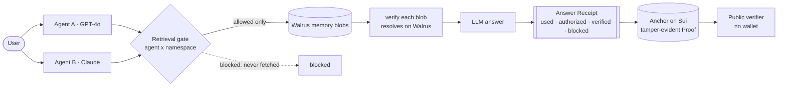

Cairn is built around one non-negotiable rule: **gate before generation.** Enforce the agent × namespace policy at _retrieval_ — the model only ever sees allowed memory — so the receipt under every answer is honest by construction.

## The big picture

## Three layers

<CardGroup cols={3}>
  <Card title="1 · Policy & gate" icon="shield-halved">
    A typed access policy — which agent can read which namespace — enforced at retrieval, before the model is called.
  </Card>
  <Card title="2 · Storage" icon="database">
    Every memory is a real content-addressed blob on Walrus, optionally encrypted through Seal + MemWal.
  </Card>
  <Card title="3 · Proof" icon="cube">
    The policy and a tamper-evident receipt chain live on Sui — the verdict is computed on-chain, not asserted by the app.
  </Card>
</CardGroup>

## Typed contracts

The system is designed around a few typed contracts in `@cairn/core` — get the boundaries right and the rest composes.

| Contract | Role |
| --- | --- |
| `Memory` | A stored fact: `namespace`, `content`, `sourceAgent`, `walrusRef` (the real blob ID), `createdAt`. |
| `Policy` | `agent → namespace → boolean`. The single source of truth the gate reads before every recall. |
| `AnswerReceipt` | The product surface: `usedMemories` (each with `authorized` + `verified` + `walrusRef`), `blockedNamespaces`, `agentId`. |

## The recall loop, step by step

This is what `POST /api/chat` does — and every step assumes the model might be wrong about what it's allowed to see.

<Steps>
  <Step title="Trigger">
    An agent receives a query.
  </Step>
  <Step title="Gate">
    `recall(agentId, query, memories, policy)` returns only the memories in namespaces this agent is allowed to read, plus the namespaces that matched the query _but were blocked by policy_. Blocked content is never loaded into the prompt. When a `policyId` is present, the allow-list is read **from the on-chain policy** via `devInspect` — no signing, no gas.
  </Step>
  <Step title="Verify">
    Each allowed memory's Walrus blob is re-checked against the aggregator (`GET /v1/blobs/{id}`). "Verified" means the blob genuinely resolves on-chain — it is **not** a flag set by the app.
  </Step>
  <Step title="Generate">
    The gated memories (and only those) are passed to the agent's model. With no allowed memory, the agent truthfully says it can't access what it needs.
  </Step>
  <Step title="Receipt">
    `buildReceipt(...)` assembles the Answer Receipt: used memories with authorization + verification status, the blocked namespaces, and the source agent.
  </Step>
  <Step title="Anchor (optional)">
    The receipt is stored to Walrus and anchored on Sui as a `Receipt` object — chained by blake2b256 — for tamper-evident provenance.
  </Step>
</Steps>

## The contrast that sells it

Revoke `agent-b × health`, ask the allergy question again, and the gate returns **zero memories** plus `blocked: ["health"]`. The model never sees the health memory, the answer is an honest refusal, and the receipt proves the block.

<Note>
Because the gate runs server-side **before** `getLLM().complete(...)`, there is no code path where a disallowed memory reaches the model — even by accident.
</Note>

## Cross-model by design

Agent A runs on **OpenAI GPT-4o**, Agent B on **Anthropic Claude**. Both share the same gated memory and the same proof format. The proof travels with the answer, not the vendor — which is what makes "memory you can trust" portable across providers.
